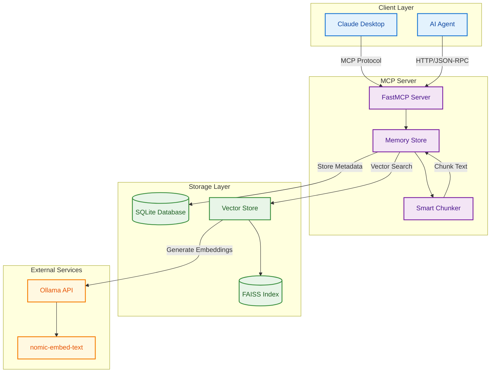
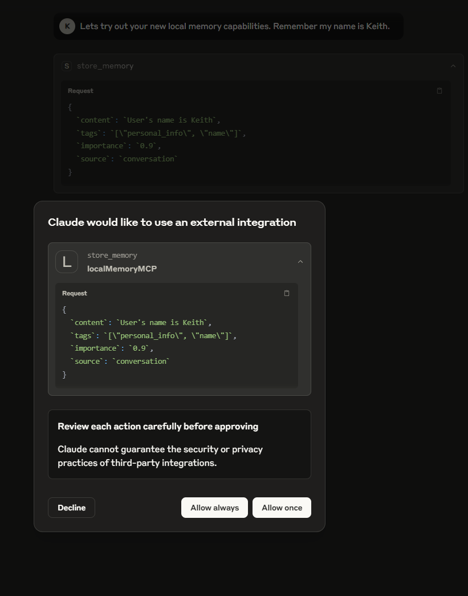
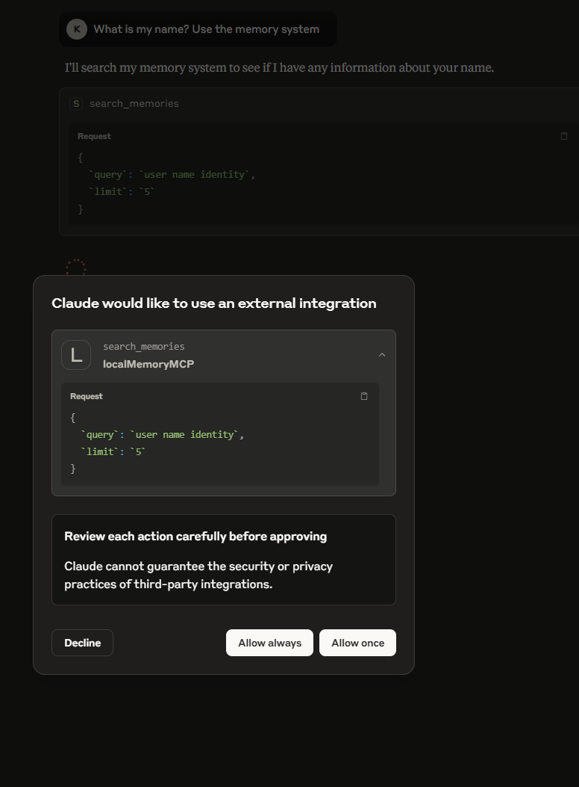
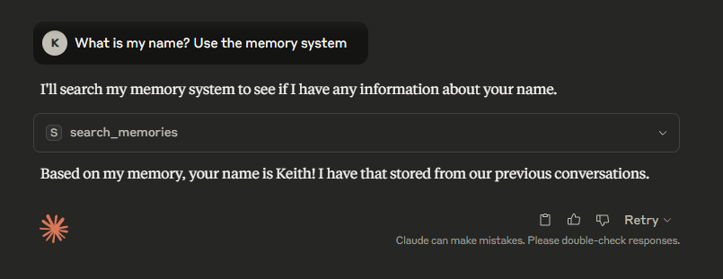

# Local Context Memory MCP

A persistent memory system for AI agents using the Model Context Protocol (MCP) with semantic search capabilities.

## Architecture



## Demo

See the local memory system in action:

### Saving Memories


*The AI agent stores contextual information for future retrieval*

### Retrieving Memories  


*Semantic search finds relevant memories based on context*

### Memory-Powered Intelligence


*The agent synthesizes retrieved memories to provide informed responses*

## Features

- **Semantic Search**: Uses Ollama embeddings with FAISS for intelligent memory retrieval
- **Smart Chunking**: Automatically breaks down long text for better search results  
- **Persistent Storage**: SQLite + FAISS for reliable local data persistence
- **MCP Standard**: Full MCP protocol compliance for Claude Desktop integration
- **Docker Ready**: Simple containerized deployment

## Quick Start

### Prerequisites
- Docker and Docker Compose
- Ollama with `nomic-embed-text` model

### Setup

1. **Install Ollama model:**
   ```bash
   ollama pull nomic-embed-text:v1.5
   ```

2. **Run the server:**
   ```bash
   git clone https://github.com/cunicopia-dev/local-memory-mcp
   cd local-memory-mcp
   ./run.sh
   ```

3. **Connect to Claude Desktop:**
   - Open Claude Desktop settings
   - Add MCP server: `http://localhost:6274`
   - Server name: "Local Memory"

## Usage

The server provides three main capabilities:

### Tools
- `store_memory(content, tags?, source?, importance?)` - Save new memories
- `update_memory(memory_id, content?, tags?, importance?)` - Update existing memories  
- `search_memories(query, limit?, use_vector?)` - Advanced search with options

### Resources
- `memory://{query}` - Quick semantic search via URI pattern

### Prompts
- `summarize_memories(memories)` - Generate summary prompts for memory lists

## Examples

```javascript
// Store a memory
store_memory(
  "User prefers Python for backend development", 
  ["programming", "preferences"], 
  "conversation", 
  0.8
)

// Search memories
search_memories("programming preferences", 5, true)

// Get memories via resource
// Access: memory://programming
```

**Components:**
- **FastMCP**: Python MCP server framework
- **SQLite**: Structured metadata and relationships
- **FAISS**: Vector similarity search
- **Ollama**: Local embedding generation
- **Smart Chunker**: Text processing for optimal retrieval

## Configuration

Environment variables:
- `OLLAMA_API_URL`: Ollama endpoint (default: `http://localhost:11434`)
- `OLLAMA_EMBEDDING_MODEL`: Model name (default: `nomic-embed-text`)
- `MCP_DATA_DIR`: Data storage path (default: `./data`)

## Development

```bash
# Run without Docker
pip install -r requirements.txt
python src/memory_server.py

# View logs
docker-compose logs -f
```

## License

MIT License