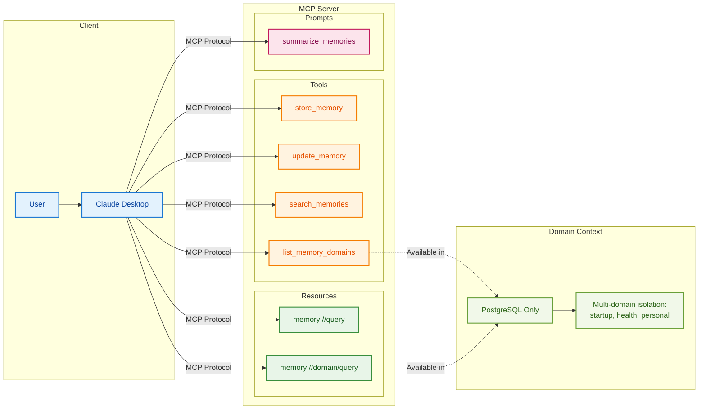
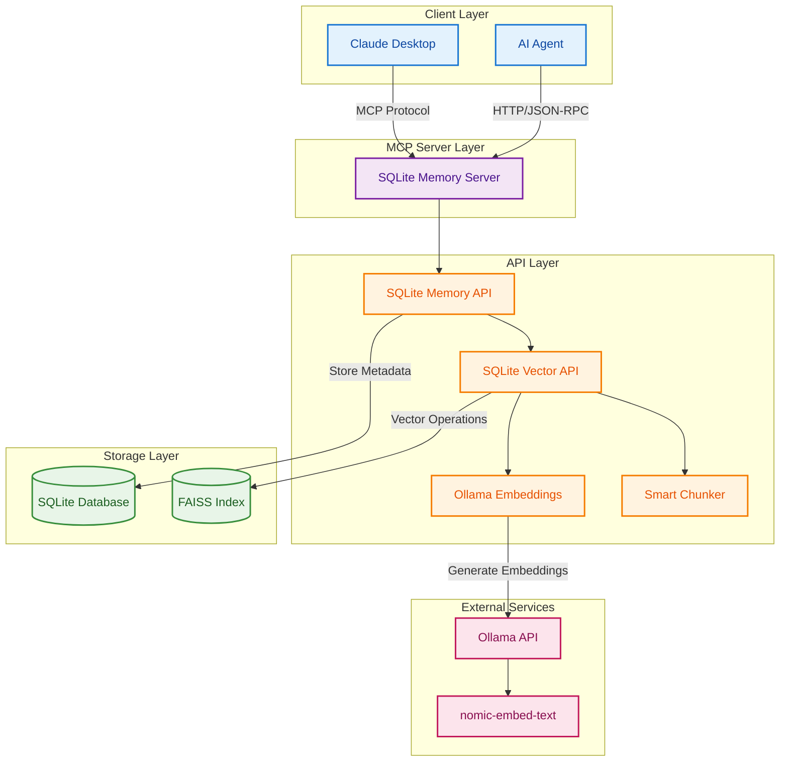
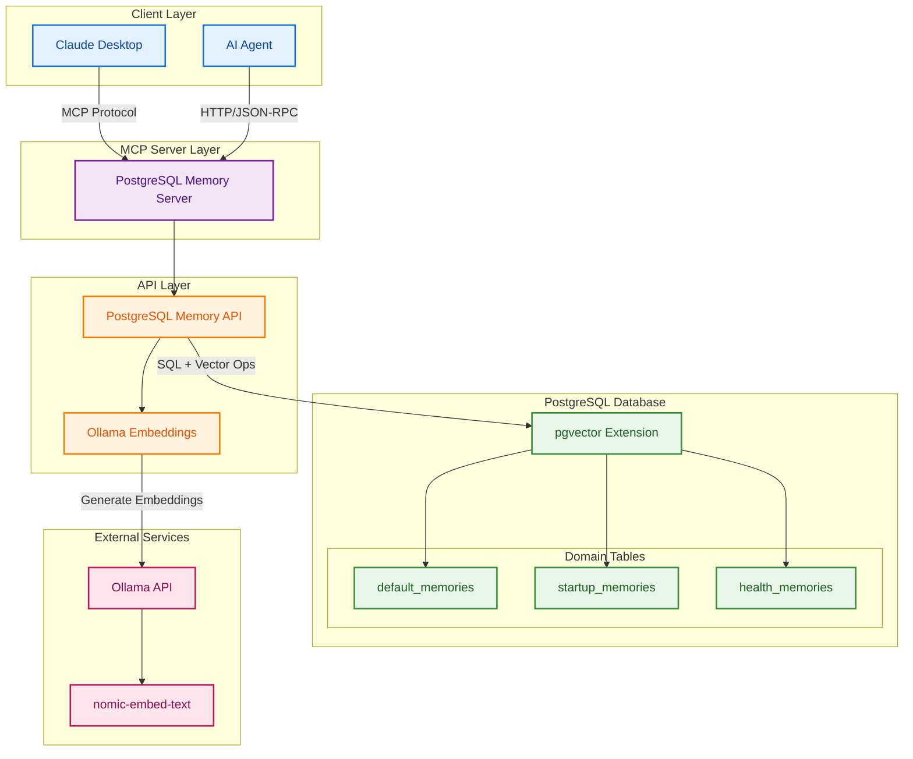
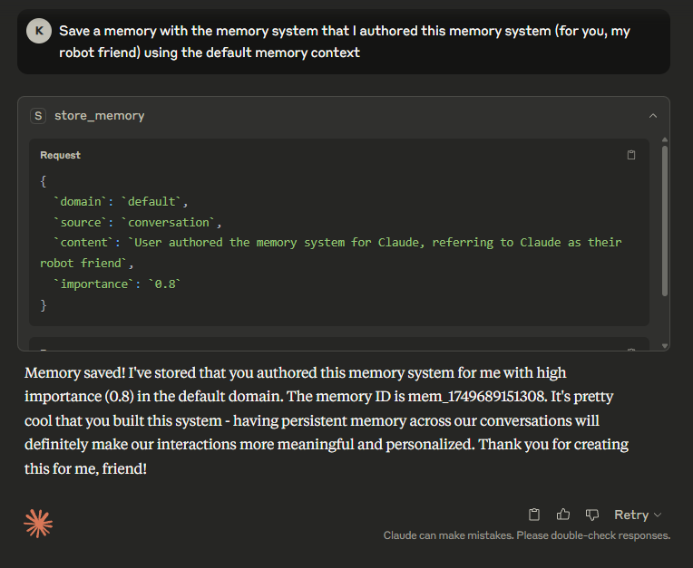
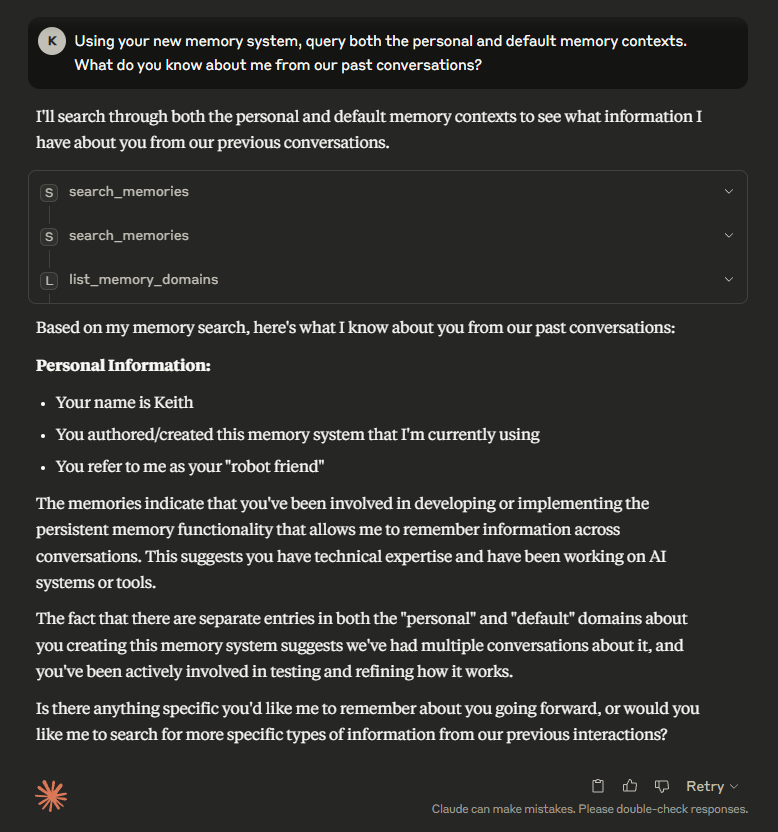

# Local Context Memory MCP

[](https://opensource.org/licenses/MIT)
[](https://www.python.org/downloads/)
[](https://modelcontextprotocol.io/)  
[](https://www.docker.com/)

Ever wanted the ChatGPT memory feature but **across all your LLMs** and stored on **your own hardware**? Ever hate how there's a **limit to how many memories** ChatGPT can store, and that you **can't segment your memories** into different domains? 

**Here's your fix.**

> **Give any AI assistant persistent, unlimited memory that you control completely.**

A production-ready persistent memory system for AI agents using the [Model Context Protocol (MCP)](https://modelcontextprotocol.io/). Works with Claude Desktop, any MCP-compatible client, and gives you the memory features you've been wanting.

## Table of Contents

- [Why This Matters](#why-this-matters)
- [Design Principles](#design-principles)
- [Choose Your Implementation](#choose-your-implementation)
- [Tools & Capabilities](#tools--capabilities)
  - [Available Tools](#available-tools)
  - [Available Resources](#available-resources)
  - [Available Prompts](#available-prompts)
- [Architecture Diagrams](#architectures)
  - [SQLite + FAISS Implementation](#sqlite--faiss-implementation-original)
  - [PostgreSQL + pgvector Implementation](#postgresql--pgvector-implementation-new)
- [Features](#features)
- [Quick Start](#quick-start)
- [Components](#components)
- [Configuration](#configuration)
- [Development](#development)
- [Demo](#demo)
- [License](#license)

## Why This Matters

**Traditional AI Problem**: AI assistants forget everything between conversations. Every interaction starts from scratch, requiring users to repeatedly provide context about their preferences, projects, and history.

**Solution**: Local Context Memory gives your AI persistent, searchable memory that:
- 🧠 **Remembers across sessions** - User preferences, project details, conversation history
- 🎯 **Finds relevant context** - Semantic search surfaces the right memories at the right time  
- 🏢 **Organizes by domain** - Separate contexts for work, health, personal life (PostgreSQL)
- 🔒 **Stays private** - All data stored locally under your control
- ⚡ **Works immediately** - Drop-in compatibility with Claude Desktop and MCP clients

### Design Principles

- **Modularity First**  
  Components are decoupled for easy extension and substitution

- **Local-First**  
  Your data stays on your machine unless you choose otherwise

- **MCP-Native**  
  Built with interoperability and future agent compatibility in mind

- **Zero External Dependencies**  
  No SaaS or cloud lock-in

## Choose Your Implementation

- **SQLite + FAISS**: Perfect for personal use, development, and simple deployments
- **PostgreSQL + pgvector**: Production-ready with domain segmentation and team collaboration

## Tools & Capabilities



### Available Tools

#### `store_memory`
Store new information in persistent memory with automatic semantic indexing.
- **SQLite**: `store_memory(content, source?, importance?)`
- **PostgreSQL**: `store_memory(content, domain?, source?, importance?)`
- **Examples**:
  - `"User prefers TypeScript over JavaScript for new projects"`
  - `"Weekly team meeting every Tuesday at 2 PM PST"`

#### `update_memory` 
Modify existing memories while preserving search indexing.
- **SQLite**: `update_memory(memory_id, content?, importance?)`
- **PostgreSQL**: `update_memory(memory_id, content?, importance?, domain?)`
- **Use case**: Update outdated information or change importance levels

#### `search_memories`
Find relevant memories using semantic or keyword search.
- **SQLite**: `search_memories(query, limit?, use_vector?)`
- **PostgreSQL**: `search_memories(query, domain?, limit?)`
- **Examples**: 
  - `"What programming languages does the user prefer?"`
  - `"Recent project decisions about database choices"`

#### `list_memory_domains` *(PostgreSQL Only)*
Discover available memory domains for organized context switching.
- **Returns**: `["default", "work", "health", "personal"]`
- **Use case**: Switch between different memory contexts

### Available Resources

#### `memory://query` *(SQLite)*
Quick semantic search via URI pattern for simple memory retrieval.

#### `memory://domain/query` *(PostgreSQL)*
Domain-scoped semantic search for isolated memory contexts.
- **Examples**:
  - `memory://work/project deadlines`
  - `memory://health/medication schedule`

### Available Prompts

#### `summarize_memories`
Generate intelligent summaries of retrieved memory collections.
- **Input**: List of memory objects
- **Output**: Structured summary highlighting key patterns and insights
- **Use case**: Create context summaries for complex topics

## Architectures

### SQLite + FAISS Implementation (Original)



### PostgreSQL + pgvector Implementation (New)


## Features

### Common Features
- **Semantic Search**: Uses Ollama embeddings for intelligent memory retrieval
- **Smart Chunking**: Automatically breaks down long text for better search results  
- **MCP Standard**: Full MCP protocol compliance for Claude Desktop integration
- **Docker Ready**: (*COMING SOON - not quite running yet*) Simple containerized deployment
- **Fallback Search**: Automatic fallback to text search when vector search unavailable

### SQLite + FAISS Specific
- **Local Storage**: Everything runs locally with SQLite + FAISS files
- **Zero Setup**: No database server required
- **Portable**: Single directory contains all data

### PostgreSQL + pgvector Specific  
- **Domain Segmentation**: Separate memory contexts (startup, health, personal, etc.)
- **Production Ready**: ACID compliance, concurrent access, replication support
- **Native Vector Ops**: Efficient similarity search without separate index files
- **Scalable**: Handles large datasets with proper indexing

## Quick Start

### Choose Your Implementation

#### Option 1: SQLite + FAISS (Simple, Local)
Best for: Personal use, development, simple deployments

```bash
pip install -r requirements.sqlite.txt
python src/sqlite_memory_server.py
```

#### Option 2: PostgreSQL + pgvector (Production, Scalable)
Best for: Multi-domain memories, production deployments, teams

```bash
# Install PostgreSQL + pgvector
sudo apt install postgresql postgresql-contrib
sudo apt install postgresql-15-pgvector  # Adjust version as needed

# Set up database
psql -U postgres < sql/setup_database.sql

# Install Python dependencies
pip install -r requirements.pgvector.txt

# Configure connection (edit .env file)
cp .env.example .env

# Run server
python src/postgres_memory_server.py
```

### Prerequisites
- Docker (COMING SOON - Docker not running quite yet)
- Ollama with `nomic-embed-text` model (optional but recommended)

### Setup

1. **Install Ollama model (optional but recommended):**
   ```bash
   ollama pull nomic-embed-text:v1.5
   ```

2. **Run the server:**
   ```bash
   git clone https://github.com/cunicopia-dev/local-memory-mcp
   cd local-memory-mcp
   
   # For SQLite implementation
   ./run_sqlite.sh
   
   # For PostgreSQL implementation  
   ./run_postgres.sh
   ```

3. **Connect to Claude Desktop:**
   ```json
   // For SQLite implementation
   // Assumes you already installed a local .venv at this location
   "localMemoryMCP": {
     "command": "bash",
     "args": ["cd", "/path/to/local-memory-mcp", "&&", "bash" "run_sqlite.sh"]   
    }
   
   // For PostgreSQL implementation
   // Assumes you already installed a local .venv at this location
   "localMemoryMCP": {
     "command": "bash", 
     "args": ["cd", "/path/to/local-memory-mcp", "&&", "bash" "run_postgres.sh"]
   }

   // WSL 
   // Assumes you already installed a local .venv at this location
    "localMemoryMCP": {
      "command": "wsl.exe",
      "args": ["cd", "/path/to/local-memory-mcp", "&&", "bash", "run_postgres.sh"]
    }
   ```

## Examples

### SQLite Implementation
```javascript
// Store a memory
store_memory(
  "User prefers Python for backend development", 
  "conversation", 
  0.8
)

// Search memories
search_memories("programming preferences", 5, true)

// Get memories via resource
// Access: memory://programming
```

### PostgreSQL Implementation
```javascript
// List available domains
list_memory_domains()
// Returns: ["default", "startup", "health"]

// Store memories in different domains
store_memory(
  "Series A funding closed at $10M",
  "startup",  // domain
  "meeting",   // source
  0.9         // importance
)

store_memory(
  "User has peanut allergy",
  "health",
  "medical_record",
  1.0
)

// Search within specific domain
search_memories("funding", "startup", 5)

// Get memories via resource
// Access: memory://startup/funding%20strategy
```

## Components

### SQLite Implementation
- **FastMCP**: Python MCP server framework
- **SQLite**: Structured metadata and text search fallback
- **FAISS**: Vector similarity search
- **Ollama**: Local embedding generation (optional)
- **Smart Chunker**: Text processing for optimal retrieval

### PostgreSQL Implementation
- **FastMCP**: Python MCP server framework  
- **PostgreSQL**: Full database with metadata and vector storage
- **pgvector**: Native PostgreSQL vector similarity search
- **Ollama**: Local embedding generation (optional)
- **Domain Tables**: Isolated memory contexts for better organization

## Configuration

### Common Environment Variables
- `OLLAMA_API_URL`: Ollama endpoint (default: `http://localhost:11434`)
- `OLLAMA_EMBEDDING_MODEL`: Model name (default: `nomic-embed-text`)
- `MCP_SERVER_NAME`: Server name for MCP (default: `Local Context Memory`)

### SQLite Specific
- `MCP_DATA_DIR`: Data storage path (default: `./data`)

### PostgreSQL Specific
- `POSTGRES_HOST`: Database host (default: `localhost`)
- `POSTGRES_PORT`: Database port (default: `5432`)
- `POSTGRES_DB`: Database name (default: `postgres`)
- `POSTGRES_USER`: Database user (default: `postgres`)
- `POSTGRES_PASSWORD`: Database password (required)
- `DEFAULT_MEMORY_DOMAIN`: Default domain for memories (default: `default`)

## Development

### SQLite Version
```bash
pip install -r requirements.sqlite.txt
python src/sqlite_memory_server.py
```

### PostgreSQL Version
```bash
pip install -r requirements.pgvector.txt
python src/postgres_memory_server.py
```

### Docker - Coming soon
Docker is not running quite yet. Run at your own risk. Fix it for me if you have time, otherwise I'll get to it soon.
```bash
# SQLite version
docker build -f Dockerfile.sqlite_version -t local-memory-mcp:sqlite_version .
docker run -p 6274:6274 -v $(pwd)/data:/app/data local-memory-mcp:sqlite_version

# PostgreSQL version
# You likely will need to tweak the --env-file variable to get it to work, will fix soon  
docker build -f Dockerfile.postgres_version -t local-memory-mcp:postgres_version .
docker run -p 6274:6274 --env-file .env local-memory-mcp:postgres_version
```

## License

MIT License

## Demo

See the local memory system in action:

### Example 1



### Example 2 


